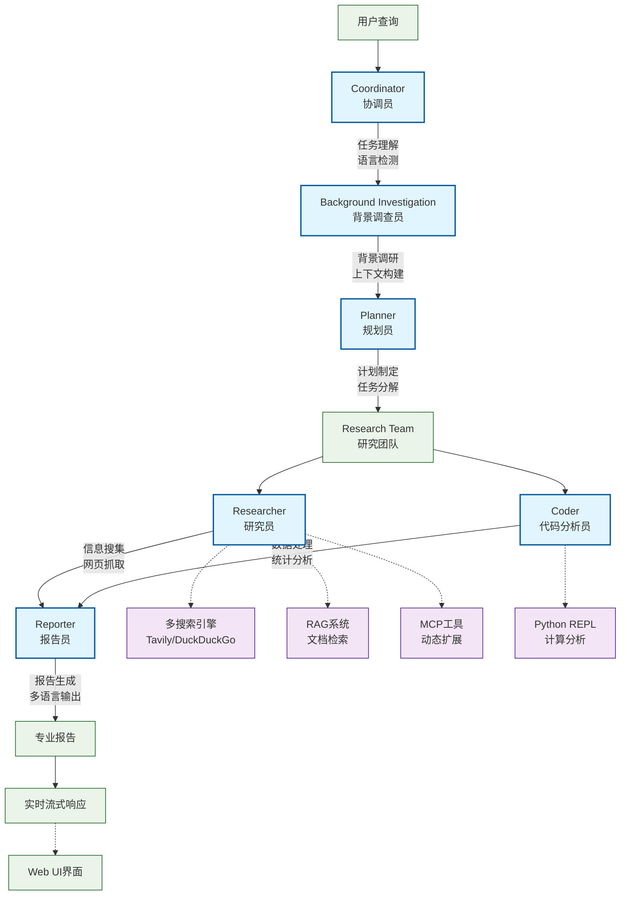

# WisdomFlow - 智能海关关税研究平台

## PPT演示文档大纲

### 第一页：项目概览与价值主张

---

## 🎯 WisdomFlow：重新定义海关关税研究

### 核心价值主张
- **智能化研究**：多AI代理协同，自动化信息收集与分析
- **专业化定制**：针对海关关税政策深度优化
- **实时性保障**：最新政策动态，权威数据源整合
- **国际化视野**：多语言支持，全球贸易政策覆盖

### 解决的核心问题
| 传统研究方式痛点 | WisdomFlow解决方案 |
|---|---|
| 手动搜索效率低下 | AI代理自动搜索、筛选、整合 |
| 信息来源分散难整合 | 多数据源统一检索和分析 |
| 政策解读专业性要求高 | 专业化AI助手深度解析 |
| 跨语言信息获取困难 | 多语言搜索与本土化输出 |
| 报告制作耗时耗力 | 自动生成结构化专业报告 |

### 应用场景
- **进出口企业**：关税政策合规性分析
- **贸易咨询公司**：客户政策解读服务
- **政府机构**：政策制定参考和影响评估
- **学术研究**：国际贸易政策比较研究

---

### 第二页：技术架构与核心能力

---

## 🏗️ 技术架构：多代理协作的智能研究引擎

### 系统架构图



### 核心技术栈
| 技术层级 | 技术选型 | 关键特性 |
|---|---|---|
| **前端层** | Next.js 15 + React 19 | 实时流式响应，现代化交互体验 |
| **后端层** | FastAPI + Python 3.12 | 高性能异步处理，类型安全 |
| **AI引擎** | LangChain/LangGraph | 多代理工作流编排，状态管理 |
| **模型层** | OpenRouter + LiteLLM | 多模型路由，灵活配置 |
| **检索层** | RAG + 多搜索引擎 | 专业文档检索，权威信息源 |

### 六大AI代理协作机制

#### 1. 协调员 (Coordinator)
- **职责**：用户交互，需求理解，语言检测
- **特点**：多语言支持，智能任务分解

#### 2. 背景调查员 (Background Investigator)  
- **职责**：初步信息收集，上下文构建
- **工具**：Tavily、DuckDuckGo、学术数据库

#### 3. 规划员 (Planner)
- **职责**：制定详细研究计划，任务分解
- **输出**：结构化研究计划，执行步骤

#### 4. 研究员 (Researcher)
- **职责**：信息搜集，网页抓取，文档检索
- **专长**：海关官网搜索，政策文件解析

#### 5. 代码分析员 (Coder)
- **职责**：数据处理，关税计算，统计分析
- **工具**：Python REPL，数据可视化

#### 6. 报告员 (Reporter)
- **职责**：生成专业研究报告
- **特点**：多语言输出，标准化格式

### 海关关税专业化能力

#### 专业数据源集成
- **官方权威源**：海关总署、WTO、各国贸易部门
- **实时政策追踪**：最新法规动态，政策变更提醒
- **多维度检索**：按商品类别、税号、原产地等

#### 智能分析功能
- **关税计算引擎**：自动计算进出口税费
- **政策影响评估**：贸易协定对特定商品的影响
- **合规性检查**：进出口流程合规性分析

---

### 第三页：海关关税研究专业功能

---

## 📊 专业功能：海关关税研究的全方位解决方案

### 核心研究功能矩阵

| 功能模块 | 具体能力 | 输出成果 |
|---|---|---|
| **政策监测** | 实时跟踪各国关税政策变化 | 政策变更报告，影响分析 |
| **关税计算** | 智能计算进出口税费 | 税费明细，成本分析 |
| **合规检查** | 贸易流程合规性验证 | 合规报告，风险提示 |
| **比较分析** | 多国政策对比研究 | 对比矩阵，优势分析 |
| **趋势预测** | 基于历史数据预测趋势 | 趋势图表，预测报告 |

### 专业化搜索策略

#### 多源信息整合
```
政府官网 (site:cbp.gov, site:customs.gov) 
    ↓
国际组织 (WTO, WCO官方文件)
    ↓  
专业数据库 (关税税率表，贸易统计)
    ↓
学术研究 (政策影响分析，案例研究)
```

#### 智能关键词策略
- **政策类**：customs regulation, trade agreement, tariff schedule
- **程序类**：import requirements, export procedures, compliance
- **数据类**：trade statistics, tariff rates, policy updates

### 研究报告标准化输出

#### 报告结构模板
1. **执行摘要** (6-10个关键发现)
2. **政策背景** (3-4段综合介绍)
3. **详细分析** (分章节深度解析)
4. **影响评估** (量化分析和预测)
5. **合规建议** (具体操作指南)
6. **权威引用** (官方文件链接)

#### 多维度分析框架
- **时间维度**：历史沿革，现状分析，趋势预测
- **地域维度**：双边政策，多边协定，区域比较
- **行业维度**：特定商品，行业影响，细分市场
- **法律维度**：法规条文，执行细则，争议解读

### 实际应用案例示例

#### 案例1：美国对华关税政策分析
- **研究范围**：2018-2024年关税变化轨迹
- **数据来源**：USTR官网，CBP税率表，贸易统计
- **分析维度**：受影响商品类别，税率变化，贸易流向
- **输出结果**：政策时间线，影响量化，企业应对策略

#### 案例2：RCEP原产地规则研究  
- **研究范围**：15个成员国原产地证明要求
- **数据来源**：各国海关官网，RCEP官方文本
- **分析维度**：规则差异，操作流程，优惠幅度
- **输出结果**：对比矩阵，操作指南，节税方案

### 技术优势与创新点

#### AI驱动的专业化
- **语义理解**：准确识别海关专业术语
- **上下文分析**：理解政策背景和关联性
- **多语言处理**：中英文政策文件无缝切换

#### 实时性保障
- **动态监测**：API接口实时获取政策更新
- **智能提醒**：关键政策变化主动推送
- **版本管理**：历史版本对比和变化追踪

---

### 第四页：商业价值与未来规划

---

## 🚀 商业价值：重塑海关关税研究生态

### 商业模式与目标市场

#### 目标客户群体
| 客户类型 | 市场规模 | 核心需求 | 价值主张 |
|---|---|---|---|
| **大型跨国企业** | 高价值客户 | 合规性管理，成本优化 | 专业咨询，风险控制 |
| **中小贸易企业** | 规模化市场 | 政策解读，操作指导 | 降低门槛，提高效率 |
| **贸易咨询机构** | 专业服务商 | 客户服务增值 | 工具赋能，专业提升 |
| **政府机构** | 政策制定者 | 决策支持，影响评估 | 数据洞察，政策优化 |

#### 收益模式设计
- **SaaS订阅**：按功能模块和使用量分级收费
- **专业咨询**：基于平台数据提供深度咨询服务
- **API服务**：为第三方系统提供数据接口服务
- **定制开发**：针对大客户特定需求定制功能

### 核心竞争优势

#### 技术壁垒
1. **专业化AI模型**：海关关税领域深度训练
2. **多源数据整合**：官方权威数据源接入能力
3. **实时更新机制**：政策变化的即时捕获和解析
4. **多语言处理**：跨语言政策文件理解能力

#### 业务壁垒  
1. **专业知识积累**：海关关税领域expertise
2. **客户关系网络**：政府机构和大企业合作
3. **数据资产沉淀**：历史政策数据和分析案例
4. **品牌认知度**：专业领域的权威性建立

### 市场机会与增长潜力

#### 市场驱动因素
- **全球贸易复苏**：后疫情时代国际贸易政策调整频繁
- **数字化转型**：传统贸易企业加速数字化升级  
- **合规要求提升**：监管环境趋严，合规成本上升
- **AI技术成熟**：大模型技术使专业AI应用成为可能

#### 潜在市场规模
- **全球贸易咨询市场**：预计2025年达到150亿美元
- **企业合规软件市场**：年增长率15%，规模持续扩大
- **政府数字化服务**：各国政府数字化转型投入增加

### 产品发展路线图

#### 第一阶段：核心功能完善 (0-6个月)
- [x] 基础多代理系统搭建
- [x] 海关关税专业化定制
- [ ] 用户界面优化和体验提升
- [ ] 核心功能稳定性测试

#### 第二阶段：功能扩展 (6-12个月)
- [ ] 增加更多官方数据源接入
- [ ] 开发关税计算和合规检查工具
- [ ] 推出移动端应用
- [ ] 建立用户反馈和迭代机制

#### 第三阶段：生态建设 (1-2年)
- [ ] 开放API平台，建立开发者生态
- [ ] 与ERP、CRM等企业系统集成
- [ ] 拓展到更多贸易相关领域
- [ ] 建立行业联盟和合作伙伴网络

#### 第四阶段：国际化扩张 (2-3年)
- [ ] 多国本地化部署
- [ ] 建立海外运营团队
- [ ] 与国际组织建立合作关系
- [ ] 打造全球贸易政策研究平台

### 风险评估与应对策略

#### 主要风险因素
1. **技术风险**：AI模型准确性，数据质量控制
2. **市场风险**：竞争加剧，客户需求变化
3. **政策风险**：数据获取限制，合规要求变化
4. **运营风险**：团队建设，资金需求

#### 风险缓解措施
- **技术风险**：建立多层验证机制，持续模型优化
- **市场风险**：专注细分领域，建立差异化优势
- **政策风险**：与官方机构建立合作，确保数据合规
- **运营风险**：分阶段投入，建立稳健的财务模型

### 成功关键因素

#### 产品层面
- **专业性**：深度的海关关税领域知识
- **准确性**：高质量的数据和可靠的分析结果
- **实时性**：及时的政策更新和变化提醒
- **易用性**：直观的界面和流畅的用户体验

#### 商业层面
- **客户关系**：与关键客户建立长期合作
- **合作伙伴**：与政府机构和行业组织联盟
- **团队建设**：吸引海关关税和AI技术专家
- **资本支持**：获得充足的发展资金

---

## 总结

WisdomFlow作为专业化的海关关税研究平台，通过多AI代理协作技术，为全球贸易参与者提供智能化、专业化、实时化的政策研究和分析服务。该平台不仅解决了传统研究方式的效率问题，更通过技术创新建立了新的行业标准，具备显著的商业价值和广阔的发展前景。